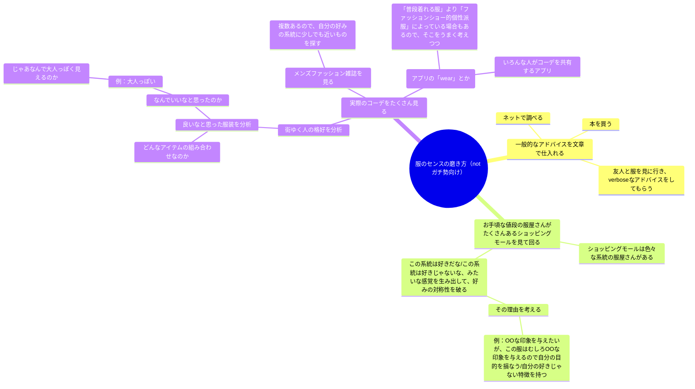
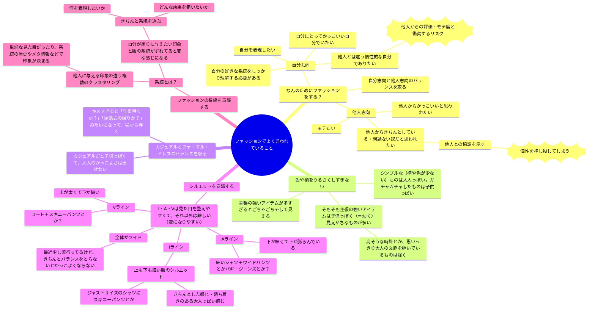
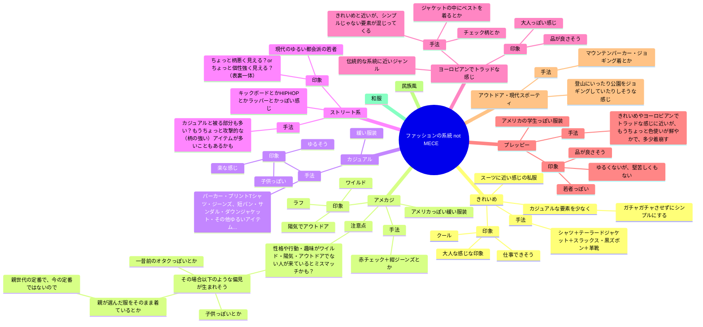
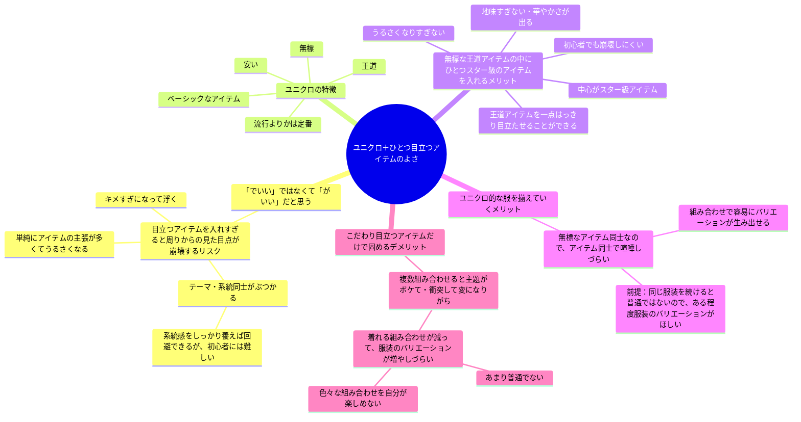

# メンズファッション第一歩

服選びについて今まで本当に何も気にしていなかったけど最近気になってきた・気にする必要が出てきた人に向けたドキュメントです。
知っている人には不要なくらいcoarseなアドバイスだと思います。

ここには自分がよく見聞きするファッション初心者向けの知識をまとめました。
ここに書かれていることはたくさんある考え方のうちの一つであって、全然違う考え方もあると思います。

## どうやって勉強するか？

以下の図にマインドマップ形式で示します。
文字ベース・理屈ベースで考えるのが好きな人向けの勉強法かもしれません。

このほかに上級者向けアイテムを最初からたくさん見るために高級店に行くとか、個性的な服を置いている店に最初に行くと言う手もあるかもしれません。
その場合でも、一般向けの服がいっぱいあるショッピングモールに行ってたくさんの系統のたくさんの服を見て、学習の回数を回すのを並行してやると良いんじゃないかなと思っています。

## 一般的なアドバイスとは？

上のセクションには「一般的なアドバイスを仕入れる」とありますが、例えばどのようなアドバイスが世間に出回っているでしょうか？

以下の図のようなことが世間でよく言われるアドバイスな気がしています。

表面的で浅いアドバイスであるとか、必ずしもこの限りでないとか、これに従っていたらファッション自我がないとか、色々な批判は考えられます。
ただ、元々ファッションがあまりわからない人が、とりあえずの「型」として身につける分には良いのではないかと思っています。
何も常識を知らないでやたらめったら手を振り回すより、先人の知恵という知識の肩に乗っかった方が楽に一定レベルに到達できるし、別に「型」を理解した後にそこからさらに自分の好みを突き詰めて「型」を離れていくことは可能だと思います。

ただ、これに背くことはしてはいけないってわけでもないと思っていまして、他人ウケと自分がやりたいことのバランスをどこに取るか、どういう場だからどっちの方向にどのくらい外していいか、自分が自分の責任で決めていくバランスの取り方もファッションの楽しみ方の一部なのではないかと思っています。

とはいえ、型を外れるファッションをする場合においても、そのファッションの一般的なファッションからの逸脱点を把握することで、その逸脱によってもたらされる周囲の人に対する印象上の効果を把握できます。逆に、そこを把握していないと、何を表現したくて型から大きく外れたファッションをしているのかが、自分から見ても他人から見ても不明瞭になってしまいうるのかなとも思います。

## メンズファッションの系統

ファッションはなんとなく系統があり、その系統によって他人に与える印象が異なります。

以下の図ではメンズファッションの系統のうち、僕が思いついたものをあげています。
別に全ての服がどれかの系統に分類できるとは限りません。なんとなく「系統の典型例」はあったとしても、そこのドンピシャな服もあれば、そこから結構離れているようなコーデもあると思います。

## 「ユニクロ＋ひとつ目立つアイテム　でいい」との主張はどういうロジック？

ここまでの説明を踏まえた上で、よく言われる「ユニクロ＋ひとつ目立つアイテムでいい」とのアドバイスがどういう判断で行われるかを書き出してみます。

## 終わりに

これはあくまで「一般的なおしゃれ」を目指すためのアドバイスです

他の方の評価なんてめちゃめちゃでいいのだ、自分が着たければ葉っぱだろうが全身タイツだろうがそれは表現なのだ！誰からも理解されずとも自分は理解しているのだ！という人もいると思います。
そういう人の役に立つ文章は書けませんでした。（というか、そういう方はすでに確固とした強烈な自分の美的感覚・表現感覚を持っているので、アドバイス不要な気がする）

この文章化が読んだあなたにとって有益であったら幸いです。
