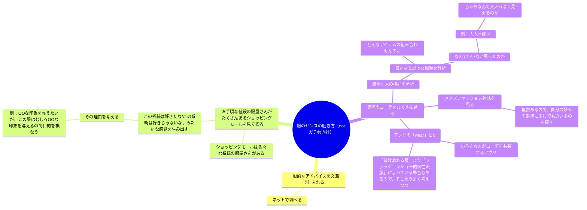
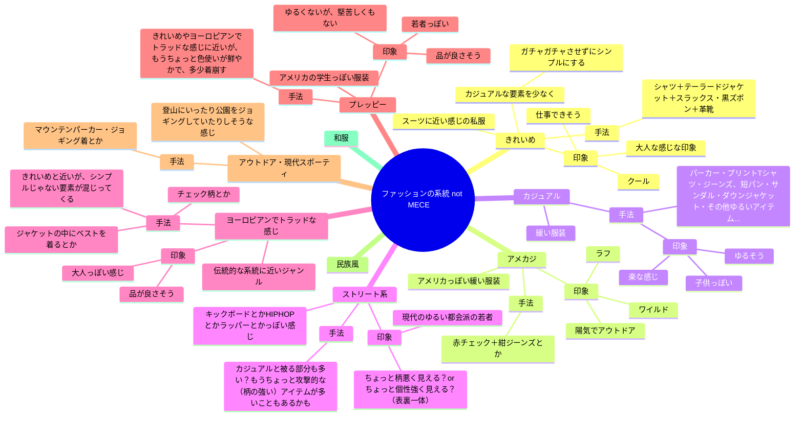
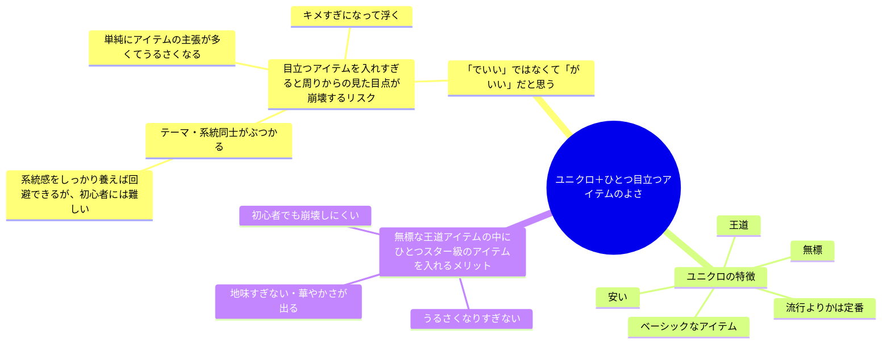

# メンズファッション第一歩

服選びについて今まで本当に何も気にしていなかったけど最近気になってきた・気にする必要が出てきた人に向けたドキュメントです。
自分がよく見聞きする知識をまとめました。
ここに書かれていることはたくさんある考え方のうちの一つであって、全然違う考え方もあると思います。

## どうやって勉強するか？

以下は文字ベース・理屈ベースで考えるのが好きな人向けの勉強法かもしれません。

このほかに上級者向けアイテムを最初からたくさん見るために高級店に行くとか、個性的な服を置いている店に最初に行くと言う手もあるかもしれません。
その場合でも、一般向けの服がいっぱいあるショッピングモールに行ってたくさんの系統のたくさんの服を見て、学習の回数を回すのを並行してやると良いんじゃないかなと思っています。

## 一般的なアドバイスとは？

上のセクションには「一般的なアドバイスを仕入れる」とありますが、例えばどのようなアドバイスが世間に出回っているでしょうか？

以下のようなことは世間でよく言われるアドバイスな気がしています。

表面的で浅いアドバイスであるとか、必ずしもこの限りでないとか、これに従っていたらファッション自我がないとか、色々な批判は考えられます。
ただ、元々ファッションがあまりわからない人が、とりあえずの「型」として身につける分には良いのではないかと思っています。
何も常識を知らないでやたらめったら手を振り回すより、先人の知恵という知識の肩に乗っかった方が楽に一定レベルに到達できるし、別に「型」を理解した後にそこからさらに自分の好みを突き詰めて「型」を離れていくことは可能だと思います。

ただ、これに背くことはしてはいけないってわけでもないと思っていまして、他人ウケと自分がやりたいことのバランスをどこに取るか、どういう場だからどっちの方向にどのくらい外していいか、自分が自分の責任で決めていくバランスの取り方もファッションの楽しみ方の一部なのではないかと思っています。

## メンズファッションの系統

ファッションはなんとなく系統があり、その系統によって他人に与える印象が異なります。

以下ではメンズファッションの系統のうち、僕が思いついたものをあげています。
別に全ての服がどれかの系統に分類できるとは限りません。なんとなく「系統の典型例」はあったとしても、そこのドンピシャな服もあれば、そこから結構離れているようなコーデもあると思います。

## 「ユニクロ＋ひとつ目立つアイテム　でいい」との主張はどういうロジック？

ここまでの説明を踏まえた上で、よく言われる「ユニクロ＋ひとつ目立つアイテムでいい」とのアドバイスがどういう判断で行われるかを書き出してみます。

